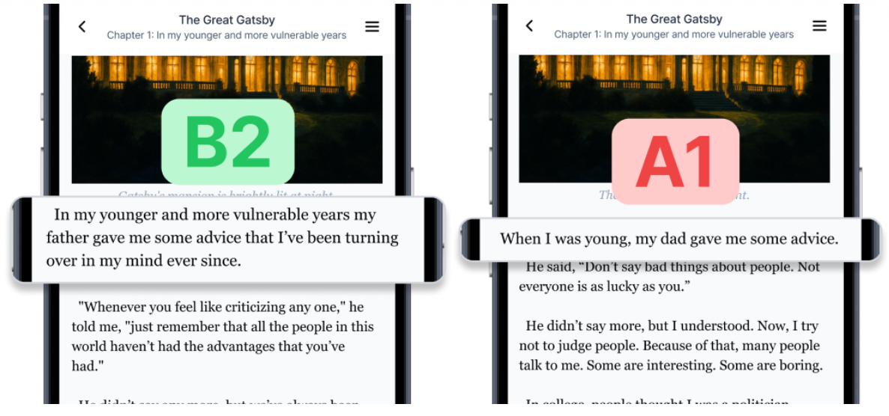
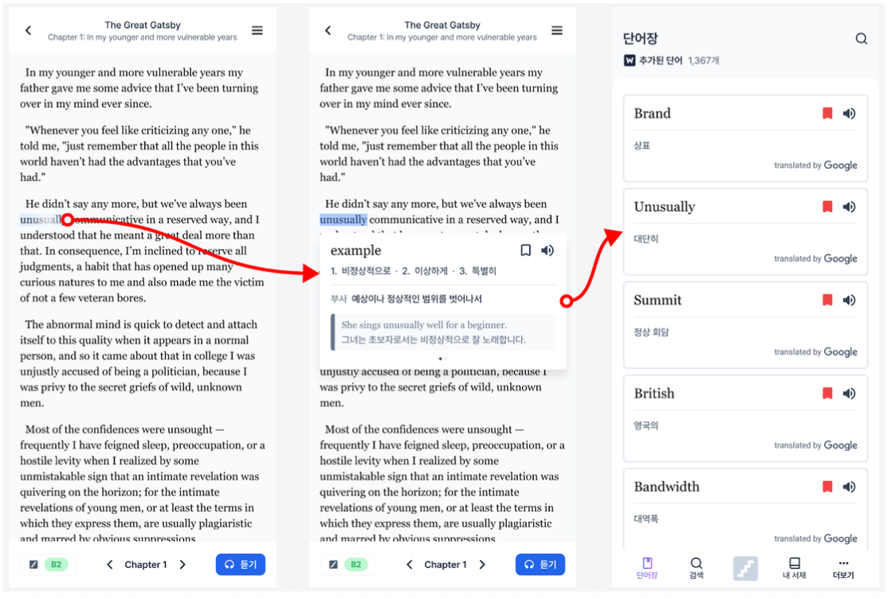
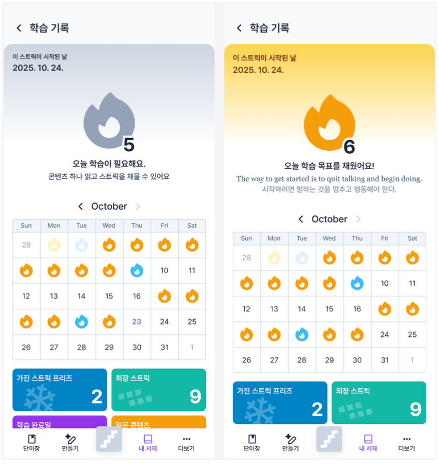
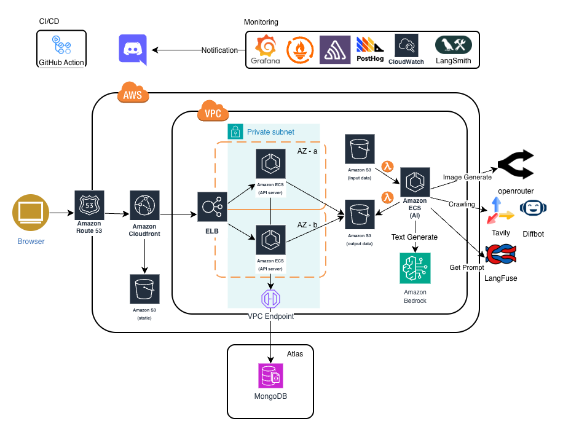

# Ling Level API

Ling Level API는 모바일 영어 학습 앱을 위한 Spring Boot 기반 백엔드 서버입니다.
학습 콘텐츠, 단어 분석, 스트릭, 추천, 알림, 크롤링, 관리자 기능을 하나의 API에서 제공합니다.

이 저장소는 기능 구현뿐 아니라 구조 개선, 성능 최적화, 안정성 강화, 운영 관찰성을 함께 관리하는 것을 목표로 합니다.

## 주요 기능

- CEFR 레벨별 영어 독해 콘텐츠 제공 (문학, 아티클, 웹 콘텐츠)
- 단어 사전 검색 및 개인 단어장 저장
- 사용자 정의 콘텐츠 레벨링 기능
- 스트릭 기반 연속 학습 기록
- Prometheus, Grafana, Sentry 기반 모니터링

## 미리보기

<details>
<summary>앱 화면 미리보기</summary>

| 콘텐츠 레벨링 | 단어 사전 |
| --- | --- |
|  |  |

| 사용자 정의 콘텐츠 | 연속 학습 기록 |
| --- | --- |
|  |  |

</details>

## 시스템 구조

<p align="center">
  
</p>

## 기술 스택

- Java 17, Spring Boot 3.5, Spring Security
- MongoDB, Redis, Redisson
- Spring AI, AWS Bedrock
- AWS S3 / Cloudflare R2, Firebase Cloud Messaging
- Bucket4j, Micrometer, Prometheus, Grafana, Sentry
- Docker Compose, k6, Testcontainers

## 로컬 실행

### 사전 요구사항

- JDK 17
- Docker Compose
- `.env.local`

`docker-compose.yml`은 `.env.local`을 읽어 애플리케이션 환경 변수를 주입합니다.
민감한 값이 포함될 수 있어 예시 파일은 저장소에 포함하지 않습니다.

### 실행

```bash
./gradlew clean build
docker compose up --build
```

애플리케이션은 기본적으로 `local` 프로필과 `8080` 포트를 사용합니다.

### 접속 정보

- Swagger UI: `http://localhost:8080/swagger-ui/index.html`
- API Docs: `http://localhost:8080/api-docs`
- Actuator health: `http://localhost:8080/actuator/health`

Swagger UI와 API Docs는 `local`, `dev` 프로필에서만 활성화됩니다.

## 테스트

```bash
./gradlew test
```

일부 통합 테스트는 Testcontainers를 사용하므로 Docker가 실행 중이어야 합니다.

## 모니터링

로컬 앱 메트릭을 Prometheus와 Grafana로 확인할 수 있습니다.

```bash
docker compose -f monitoring/docker-compose.monitoring-local.yml up -d
```

- Prometheus: `http://localhost:9090`
- Grafana: `http://localhost:3000`
