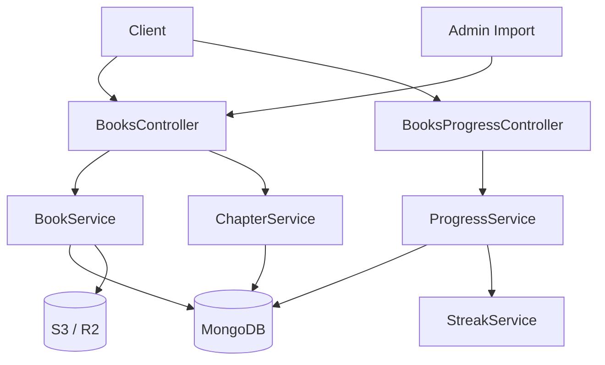
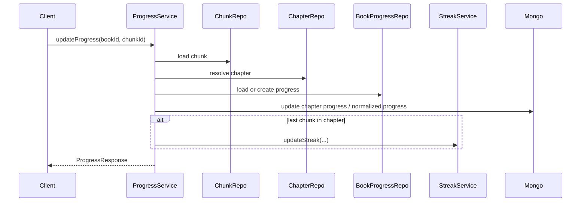

# Book 도메인 구조

## 목적

이 문서는 책 콘텐츠 도메인이 조회, 진행도, import, 이미지 처리를 어떻게 함께 다루는지 설명한다.

## 범위

- `BookService`
- `ChapterService`
- `ProgressService`
- 책 import 및 이미지 처리

## 핵심 구성 요소

- `BooksController`, `BooksProgressController`
- `BookService`
- `ChapterService`
- `ProgressService`
- `BookRepository`, `ChapterRepository`, `ChunkRepository`, `BookProgressRepository`

## 구조 요약

Book 도메인은 사용자에게 보이는 조회 API와 운영성 있는 import 파이프라인이 함께 들어 있는 구조다.
책 기본 정보와 챕터/청크는 MongoDB에 저장되고, import 시에는 AI 결과 파일 다운로드, 이미지 이동, 썸네일 생성이 같이 수행된다.
사용자 진행도는 책 단위가 아니라 챕터와 청크를 기반으로 계산되며, 읽기 완료는 스트릭 갱신으로 이어진다.

## Mermaid 다이어그램

### 구조 관계

### 대표 흐름: 진행도 업데이트와 스트릭 연결

## 주요 흐름 설명

1. `BookService`는 책 조회와 import를 함께 담당한다.
2. 조회 시에는 사용자 진행도를 합쳐 `BookResponse`를 만들고, import 시에는 AI 결과 파일 다운로드와 이미지 후처리까지 수행한다.
3. `ChapterService`는 챕터 목록 조회와 탐색을 맡고, 챕터별 청크 수와 사용자 진행도를 조합해 응답을 만든다.
4. `ProgressService`는 청크 단위 요청을 챕터 단위 진행도와 책 완료 상태로 변환하고, 마지막 청크를 읽은 경우 `StreakService`를 호출한다.

## 핵심 데이터

- `Book`
  - 책 메타데이터, 표지 이미지, 난이도, 챕터 수
- `Chapter`
  - 챕터 번호, 설명, 읽기 시간
- `Chunk`
  - 난이도별 세부 텍스트 조각
- `BookProgress`
  - 사용자별 현재 청크, 챕터별 진행도, 완료 여부

## 이 도메인의 특징

- 조회 응답이 단순 조회가 아니라 사용자 진행도와 이미지 URL 조합을 포함한다.
- import와 조회가 가까운 서비스에 있어 운영 기능과 사용자 API가 한 도메인 아래 모여 있다.
- 챕터 완료 판단은 청크 수 기준으로 계산되고, 책 완료 여부는 챕터 진행도 배열을 기반으로 계산된다.

## 개선 포인트

- `BookService`는 import, 이미지 처리, 조회 응답 조립이 함께 있어 책임 분리가 가능하다.
- `ProgressService`는 검증, 진행도 계산, 읽기 완료 처리, 스트릭 연계를 한 번에 수행한다.
- `ChapterService`는 조회 응답 조립과 view count 증가, backward compatibility 로직이 같이 들어 있다.

## 참고 코드

- `src/main/java/com/linglevel/api/content/book/service/BookService.java`
- `src/main/java/com/linglevel/api/content/book/service/ChapterService.java`
- `src/main/java/com/linglevel/api/content/book/service/ProgressService.java`
- `src/main/java/com/linglevel/api/content/book/entity/Book.java`
- `src/main/java/com/linglevel/api/content/book/entity/BookProgress.java`
