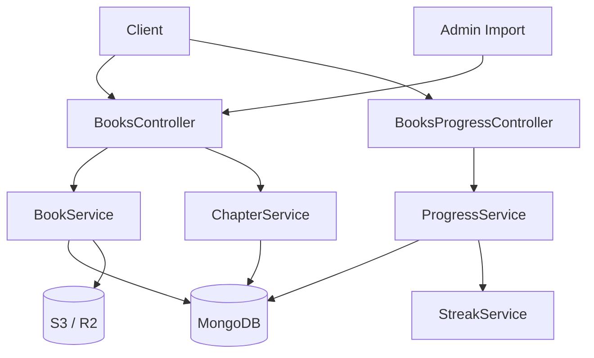
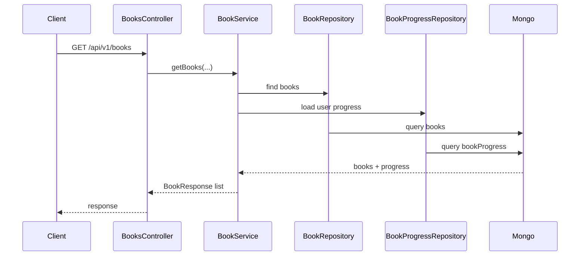
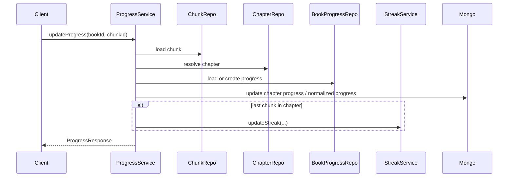

# Book 도메인 미니맵

## 현재 시스템의 책임
- 책, 챕터, 청크로 구성된 콘텐츠를 관리한다.
- 사용자에게 책 콘텐츠를 제공하고, 읽기 진행도를 계산·저장한다.
- 관리자가 새로운 책과 콘텐츠를 등록할 수 있도록 한다.

## 도메인 구조
- 책은 여러 개의 챕터로 구성된다.
- 챕터는 여러 개의 청크로 구성된다.
- 청크는 텍스트, 이미지 등의 타입을 가질 수 있다.

## 핵심 용어 사전

| 용어 | 정의 |
| --- | --- |
| Book | 여러 챕터를 포함하는 최상위 학습 콘텐츠 |
| Chapter | Book 내부의 순차 학습 단위 |
| Chunk | Chapter 내부의 세부 학습 단위(텍스트/이미지 등) |
| BookProgress | 사용자별 책 학습 상태를 저장하는 엔티티 |
| normalizedProgress | 완료된 챕터 수를 기준으로 계산한 책 진행률(%) |
| maxReadChunkNumber | 챕터/청크 조합 위치를 전역 순서값으로 환산한 최대 도달 지표 |

## 핵심 불변식

1. 책 진행률(`normalizedProgress`)은 챕터 완료 기반으로 계산한다.
2. 상태 분류(`NOT_STARTED`, `IN_PROGRESS`, `COMPLETED`)는 `normalizedProgress`와 `isCompleted`만으로 판정한다.
3. `maxReadChunkNumber`는 챕터 우선 정렬 기준으로 계산한다. 비교 순서는 `(chapterNumber, chunkNumber)`이며, chapter가 더 크면 항상 더 큰 진행 위치로 본다.
4. `GET /progress`는 학습 상태를 변경하지 않는다. (progress 문서 생성/수정 금지, 검증 중)
5. GET API의 부작용은 분석 목적(`viewCount`, 읽기 세션 시작)으로만 허용한다.
6. 진행도 모델은 V3 단일 경로를 목표로 하며, fallback은 검증 완료 후 제거한다.

## 외부 시스템 의존성

- MongoDB: 책, 챕터, 청크, 진행도 저장
- S3 / R2: 표지 이미지와 import 산출물 저장
- StreakService: 읽기 완료 이후 스트릭 반영

## 핵심 기능

- 책 목록 조회
- 진행도 업데이트
- 책 import 및 이미지 처리

## 핵심 기능 흐름

### 책 목록 조회

### 진행도 업데이트와 스트릭 연결

## 핵심 기능 선정 기준

1. 책 목록 조회는 사용자 트래픽과 성능 이슈가 가장 자주 모이는 진입점이다.
2. 진행도 업데이트는 `book`, `chapter`, `chunk`, `streak`를 함께 이해해야 한다.
3. import는 운영 기능이지만 파일 저장과 후처리가 함께 묶여 있어 읽기 진입점으로 가치가 있다.

## 간결 의사결정 기록

| 날짜 | 결정 | 이유 | 영향 범위 | 상태 |
| --- | --- | --- | --- | --- |
| 2026-04-08 | Book 도메인은 책/챕터/청크 3계층 구조를 문서 표준으로 유지 | 기능 확장 시 공통 읽기 모델을 보존하기 위함 | BookService, ChapterService, ProgressService | 유지 |
| 2026-04-08 | 진행도 갱신과 스트릭 연동 흐름을 핵심 시나리오로 고정 | 교차 도메인 영향이 가장 큰 지점이기 때문 | ProgressService, StreakService | 유지 |
| 2026-04-08 | `normalizedProgress`를 챕터 완료 기반으로 통일 | 청크만으로는 책 진행 의미를 안정적으로 표현하기 어려움 | ProgressService, BookService | 유지 |
| 2026-04-08 | 상태 판정은 `normalizedProgress` + `isCompleted`로 단일화 | 상태 분류 기준 다중화로 인한 의미 흔들림 방지 | BookRepositoryImpl, BookService, ProgressService | 유지 |
| 2026-04-08 | `maxReadChunkNumber`를 정식 필드로 유지하고 챕터 우선 `(chapterNumber, chunkNumber)` 순서로 계산 | 챕터 경계를 보존한 진행 위치 비교를 위해서 | BookProgress, ProgressService, DTO | 유지 |
| 2026-04-08 | `GET /progress`에서 progress 미존재 시 0% 조회 정책 검증 | 조회 API의 상태 변경 부작용 제거 필요 | BooksProgressController, ProgressService | 검증 중 |
| 2026-04-08 | GET API는 분석성 부작용만 허용 | 사용자 학습 상태와 운영 지표를 분리하기 위함 | ChapterService, ReadingSessionService | 유지 |
| 2026-04-08 | V3 단일화 전환 가능성 사전 검증 후 fallback 제거 | 데이터 호환성 리스크를 통제하기 위함 | ProgressService, ChapterService, ChapterRepositoryImpl | 검증 중 |

## 검증 필요 항목

- `GET /progress`에서 progress 문서가 없는 경우에도 DB 변경 없이 0% 응답 가능한지 확인
- V3 단일화 시 기존 데이터/조회 경로에서 fallback 제거해도 회귀가 없는지 확인

## 참고 코드

- `src/main/java/com/linglevel/api/content/book/service/BookService.java`
- `src/main/java/com/linglevel/api/content/book/service/ChapterService.java`
- `src/main/java/com/linglevel/api/content/book/service/ProgressService.java`
- `src/main/java/com/linglevel/api/content/book/entity/Book.java`
- `src/main/java/com/linglevel/api/content/book/entity/BookProgress.java`
