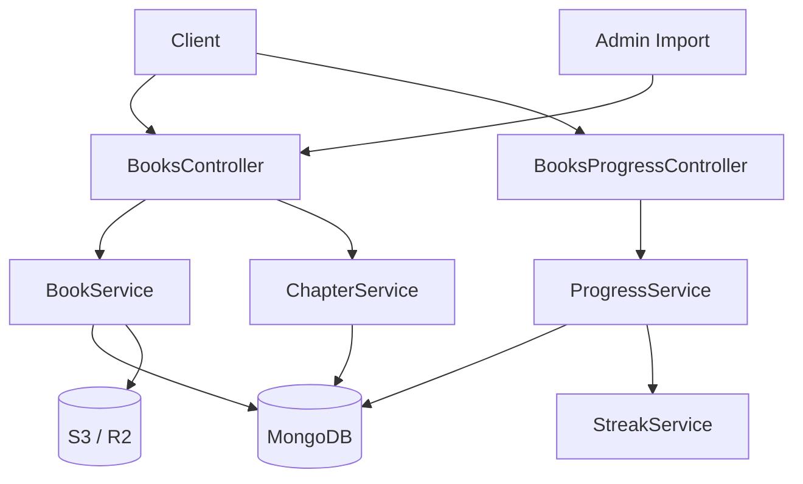
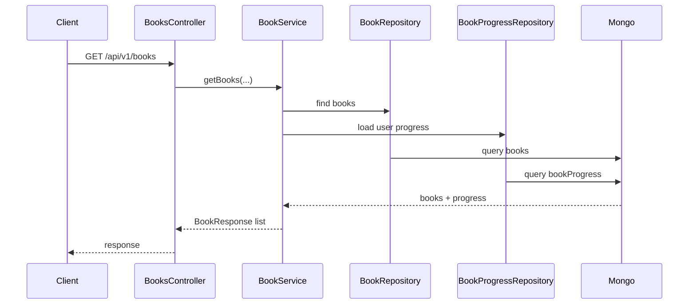
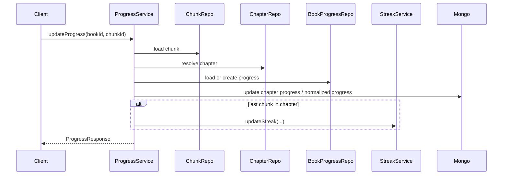

# Book 도메인 미니맵

## 현재 시스템의 책임

- 책은 여러 개의 챕터를 가지고 챕터는 여러개의 청크를 가진다.
- 사용자 책 읽기 진행도를 계산하고 저장한다.
- 관리자에 의해서 책이 추가로 등록될 수 있다.
- 청크는 이미지와 글자와 같은 타입을 가질 수 있다.

## 외부 시스템 의존성

- MongoDB: 책, 챕터, 청크, 진행도 저장
- S3 / R2: 표지 이미지와 import 산출물 저장
- StreakService: 읽기 완료 이후 스트릭 반영

## 핵심 기능

- 책 목록 조회
- 진행도 업데이트
- 책 import 및 이미지 처리

## 핵심 기능 흐름

### 책 목록 조회

### 진행도 업데이트와 스트릭 연결

## 핵심 기능 선정 기준

1. 책 목록 조회는 사용자 트래픽과 성능 이슈가 가장 자주 모이는 진입점이다.
2. 진행도 업데이트는 `book`, `chapter`, `chunk`, `streak`를 함께 이해해야 한다.
3. import는 운영 기능이지만 파일 저장과 후처리가 함께 묶여 있어 읽기 진입점으로 가치가 있다.

## 참고 코드

- `src/main/java/com/linglevel/api/content/book/service/BookService.java`
- `src/main/java/com/linglevel/api/content/book/service/ChapterService.java`
- `src/main/java/com/linglevel/api/content/book/service/ProgressService.java`
- `src/main/java/com/linglevel/api/content/book/entity/Book.java`
- `src/main/java/com/linglevel/api/content/book/entity/BookProgress.java`
