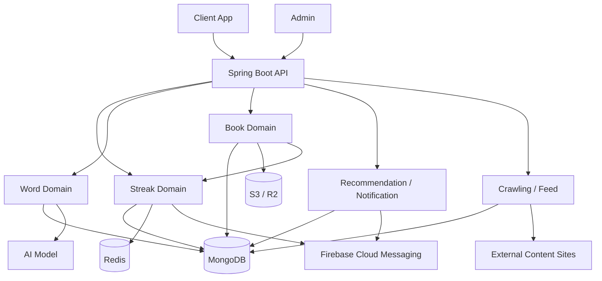

# 프로젝트 전체 구조 개요

## 목적

이 문서는 `llv-api`의 상위 구조를 한 장으로 설명하기 위한 문서다.
세부 구현보다 어떤 도메인이 핵심이고, 어떤 저장소와 외부 시스템이 붙어 있는지 빠르게 파악하는 데 초점을 둔다.

## 범위

- 주요 사용자 요청 경로
- 핵심 도메인 묶음
- 공통 인프라와 외부 시스템
- 우선 문서화 대상 도메인

## 핵심 구성 요소

- API 진입점: `controller`
- 핵심 도메인: `streak`, `word`, `content/book`
- 보조 도메인: `content/recommendation`, `fcm`, `crawling`
- 공통 인프라: MongoDB, Redis, S3/R2, Spring AI, FCM

## 구조 요약

이 프로젝트는 하나의 Spring Boot 애플리케이션 안에 학습 콘텐츠, 단어 분석, 스트릭, 추천, 알림, 크롤링, 파일 처리 기능을 함께 두고 있다.
데이터 저장은 MongoDB를 중심으로 하고, Redis는 읽기 세션과 rate limit 같은 짧은 상태 관리에 사용한다.
외부 연동은 AI 모델, FCM, S3/R2, 크롤링 대상 사이트가 중심이며, 도메인 서비스가 이 인프라를 직접 조합하는 구조가 많다.

## Mermaid 다이어그램

## 주요 흐름 설명

1. `book`, `word`, `streak` 요청은 각각 전용 서비스로 들어가지만, 실제 사용자 학습 흐름에서는 서로 연결된다.
2. `content/book`의 읽기 완료는 `streak` 갱신과 이어지고, 읽기 로그는 `content/recommendation`에서 선호도 집계에 사용된다.
3. `word`는 MongoDB 캐시와 AI 호출을 조합해 결과를 만들고, `streak`는 Redis 읽기 세션과 MongoDB 리포트를 함께 사용한다.
4. `crawling`과 `feed`는 외부 사이트 구조 변화에 영향을 많이 받는 별도 리스크 영역이다.

## 핵심 도메인

### `streak`

- 사용자 학습 연속성, 프리즈, 보상, 알림을 담당한다.
- Redis 기반 읽기 세션과 MongoDB 기반 누적 리포트를 함께 사용한다.
- 스케줄러와 알림이 얽혀 있어 구조적으로 가장 복잡한 영역 중 하나다.

### `word`

- 단어 조회, 원형/변형 매핑, AI 분석, 유효하지 않은 단어 차단을 담당한다.
- 캐시와 AI 호출, 응답 검증이 한 흐름에 들어가 있어 비용과 안정성 측면에서 중요하다.

### `content/book`

- 책 조회, 챕터/청크, 진행도, 이미지 처리, 가져오기(import)까지 맡는다.
- 조회 성능과 진행도 계산, 다른 도메인과의 연결 지점이 함께 모여 있다.

## 공통 인프라

### MongoDB

- 주요 도메인 엔티티와 로그, 추천 데이터를 저장한다.
- 도메인 서비스는 Mongo 문서 구조를 직접 전제로 동작하는 경우가 많다.

### Redis

- `streak` 읽기 세션과 `common/ratelimit` 같은 짧은 상태 관리에 사용된다.

### S3 / R2

- 책 이미지와 AI 생성 결과 파일 처리를 담당한다.
- `content/book`는 import 이후 이미지 이동과 썸네일 생성까지 이어진다.

### AI / FCM / External Sites

- AI는 `word` 분석의 핵심 의존성이다.
- FCM은 `streak`, `notification` 쪽에서 사용된다.
- 외부 사이트는 `crawling`, `feed` 영역의 가장 큰 불안정 요소다.

## 현재 문서화 우선순위

- [Streak 도메인 구조](streak.md)
- [Word 도메인 구조](word.md)
- [Book 도메인 구조](content-book.md)

## 개선 포인트

- `streak`는 상태 계산, 보상, 통계, 알림 관련 책임이 큰 서비스에 집중돼 있다.
- `word`는 캐시 정책과 AI 실패 처리, 응답 검증이 서비스 흐름 안에 함께 들어가 있다.
- `content/book`는 조회, import, 이미지 처리, 진행도 계산이 서로 가까이 있어 변경 영향 범위가 넓다.
- 외부 의존성이 큰 `crawling`, `feed`는 이후 안정성 문서에서 별도로 다루는 편이 맞다.
