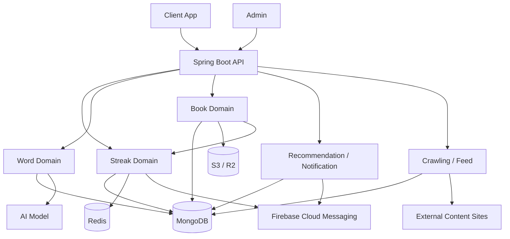

# 프로젝트 전체 컨텍스트

## 현재 시스템의 책임

- 모바일 학습 앱의 API를 제공한다.
- 책 읽기, 단어 조회, 스트릭 유지 같은 핵심 학습 기능을 한 애플리케이션에서 처리한다.
- 추천, 알림, 크롤링, 파일 처리 같은 보조 기능도 함께 운영한다.

## 외부 시스템 의존성

- MongoDB: 주요 도메인 데이터와 로그 저장
- Redis: 읽기 세션과 짧은 상태 관리
- S3 / R2: 이미지와 파일 저장
- AI Model: 단어 분석과 생성 요청
- FCM: 푸시 알림 발송
- External Content Sites: 크롤링 대상

## 핵심 기능

- 책 읽기와 진행도 반영
- 단어 조회와 AI 기반 보완
- 스트릭 계산과 보상/알림 처리

## 핵심 기능 흐름

## 핵심 기능 선정 기준

1. 실제 사용자 요청이 자주 통과하는 기능이다.
2. 외부 의존성이나 도메인 결합이 있어 이해 난이도가 높다.
3. 리팩터링이나 성능 개선 시 영향 범위가 큰 영역이다.
