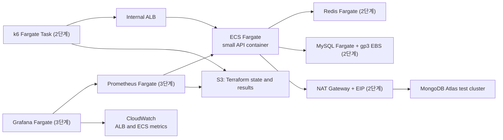

# 재사용 가능한 부하 테스트 플랫폼 계획

## 목적과 범위

도메인별 부하 테스트가 공통으로 사용할 AWS 실행 기반이다. 테스트마다 런타임 인프라를 생성하고 결과를 수집한 뒤 제거한다.
운영 환경을 복제하는 것이 아니라 API 인스턴스 수와 외부 의존성 연결을 통제해 비교 가능한 실험을 만드는 것이 목표다.

첫 번째 experiment는 Word single-flight다. 이후 Book 조회, 저장소 전환, 외부 의존성 장애 대응도 같은 플랫폼을 사용한다.

플랫폼은 한 번에 완성하지 않는다. 배포·삭제, 의존성 연결과 부하 발생, 메트릭 수집을 순서대로 검증한다.

## 단계별 목표

| 단계 | 검증 목표 | 포함 구성 | 성공 기준 |
| --- | --- | --- | --- |
| 1단계 | Terraform으로 작은 애플리케이션 컨테이너를 배포하고 완전히 제거한다. | VPC, Internal ALB, ECS Fargate API, CloudWatch Logs | `apply` 후 ALB health check 성공, `destroy` 후 런타임 리소스가 남지 않는다. |
| 2단계 | 공통 의존성을 연결한 상태에서 k6 부하가 API까지 도달한다. | 1단계 + k6 task, Redis, MySQL, MongoDB Atlas | k6가 ALB를 통해 요청하고 API 또는 probe가 Redis·Atlas·MySQL 연결을 모두 확인한다. |
| 3단계 | 동일 실행의 요청·응답·자원 메트릭을 Grafana로 조회하고 보관한다. | 2단계 + Prometheus, Grafana, CloudWatch datasource, 결과 S3 | 고정 dashboard에서 1~3레이어 지표를 조회하고, k6·PromQL 원본 결과와 실행 manifest가 S3에 남는다. |

Redis와 Atlas는 현재 서비스의 의존성이다. 현재 애플리케이션에 MySQL 사용 경로는 없으므로 2단계에서는 부하 테스트 전용 probe endpoint 또는 별도 probe container로 MySQL 연결을 검증한다. 운영 API에 테스트 전용 엔드포인트를 상시 노출하지 않는다.

## 1~3단계 AWS 구성



| 구성 요소 | 실행 방식 | 역할 |
| --- | --- | --- |
| API | ECS Fargate | 1단계에서는 작은 API 컨테이너로 배포 수명 주기를 검증한다. API 인스턴스 수 비교는 후속 실험에서 추가한다. |
| ALB | Internal ALB | VPC 내부 k6 task 요청을 API task로 라우팅한다. |
| MongoDB | MongoDB Atlas | 도메인 테스트 데이터를 저장한다. NAT EIP만 임시 allowlist에 등록한다. |
| Redis | ECS Fargate | 현재 서비스의 short-lived state와 single-flight 조정을 제공한다. |
| MySQL | ECS Fargate + managed gp3 EBS | 향후 MySQL 전환 기능을 위한 연결 경로를 사전 검증한다. |
| Prometheus | ECS Fargate | 3단계에서 API의 `/actuator/prometheus` 메트릭을 수집하고 종료 전에 원본 query 결과를 내보낸다. |
| Grafana | ECS Fargate | Prometheus와 CloudWatch를 같은 시간축으로 조회하는 고정 dashboard를 제공한다. |
| k6 | ECS Fargate task | 2단계에서 단일 task의 다수 VU로 ALB를 통해 부하를 생성한다. |

## 관측 계획

### 원칙

카카오의 레이어 1~3과 Google SRE의 latency, traffic, errors, saturation 신호는 테스트 실행 내내 수집한다.
문제가 확인된 뒤 코드 위치를 찾는 JFR, thread dump, heap dump 같은 레이어 4 진단은 상시 수집 대상이 아니라 별도 runbook으로 둔다.

Grafana는 사람이 보는 dashboard이고, AI 보고서의 근거는 화면 이미지가 아니라 같은 시간 범위의 PromQL 원본 결과와 k6 원본 결과다.

### 공용 플랫폼 지표

| 레이어 | 지표 | 수집 경로 | 현재 상태와 보완 방법 |
| --- | --- | --- | --- |
| Client | attempted/successful/failed RPS, P50/P95/P99, active VU, dropped iteration | k6 | P95/P99와 전체 실패율은 수집한다. P50, 성공·실패 latency, 오류 유형, connection/waiting 시간은 summary와 dashboard에 추가한다. |
| Endpoint | endpoint별 RPS, 성공·실패 latency, 4xx/5xx, 비즈니스 오류 | Actuator -> Prometheus | HTTP 요청 count는 가능하다. `http.server.requests` histogram을 활성화하고, 예외와 `ErrorCode`를 bounded label의 Counter로 추가한다. |
| ALB/ECS | target response time, ELB/target 5xx, healthy target, task CPU/memory/network, restart | CloudWatch -> Grafana | 3단계에서 Grafana CloudWatch datasource 또는 report collector로 수집한다. JVM process 지표만으로 task 포화를 판단하지 않는다. |
| JVM/Tomcat | process CPU/RSS, heap/old gen, GC pause/allocation, thread state, Tomcat busy/max thread와 connection | Actuator -> Prometheus | JVM 기본 binder는 사용 가능하다. 실제 scrape에서 Tomcat metric 이름을 검증하고 고정 dashboard panel을 추가한다. |
| Saturation | in-flight request, queue wait, rejection/rate limit/circuit-breaker 차단 | Actuator와 application custom metric | 명시적 executor queue는 아직 없다. Tomcat busy thread와 application boundary의 in-flight Gauge/Counter를 추가한다. |
| 실행 맥락 | test run, Git SHA, image digest, task size, VU, duration, 시작/종료 시각 | manifest, Grafana annotation | `manifest.json`으로 보관한다. 사용자 ID, 단어, 요청 ID처럼 cardinality가 무한한 값은 metric label로 사용하지 않는다. |

### 도메인 실험 지표

공용 플랫폼 3단계가 완료된 뒤 각 experiment가 추가한다. 첫 번째 Word single-flight experiment는 아래 지표를 수집한다.

| 관심사 | 지표 | 수집 방법 |
| --- | --- | --- |
| Single-flight | leader/follower count, follower wait duration, follower timeout, lock acquire/release failure | `WordSingleFlightRedisCoordinator` 경계에 Micrometer Counter/Timer 추가 |
| Bedrock | call duration, success/timeout/error, retry count, in-flight call, circuit breaker state/rejection | `WordBedrockClient` 경계에 Micrometer Timer/Counter/Gauge 추가, Resilience4j metric 실제 노출 검증 |
| Word 결과 | existing/generated/fallback/invalid/failed 결과 수, duplicate save recovery | `WordService`의 결과 분기에서 bounded `outcome` Counter 추가 |
| 외부 의존성 | Mongo/Redis 호출 duration과 error | DB 자체 exporter보다 애플리케이션 gateway 경계의 Timer/Counter를 우선 추가 |

### 실행 결과 계약

각 실행은 아래 파일을 동일한 `test_run_id` 경로에 저장한다.

```text
s3://<result-bucket>/runs/<test_run_id>/
├── manifest.json          # 이미지, 커밋, task size, scenario, 시간 범위
├── k6-summary.json        # k6 원본과 요약
├── promql-results.json    # dashboard panel별 query, start/end/step, 원본 시계열
├── cloudwatch-results.json # ALB/ECS query 결과
├── dashboard.png          # 사람이 빠르게 확인하는 보조 산출물
└── report.md              # 사람이 검토한 최종 결론
```

AI 보고서는 `manifest.json`, k6·PromQL·CloudWatch 원본 결과를 입력으로 사용한다. 결론에는 비교 대상, 수치, 시간 구간을 명시하고, 데이터가 없는 원인은 추정하지 않고 추가 확인 항목으로 남긴다.

## Terraform 경계

Terraform 코드는 `infra/performance-test/terraform`에 둔다. 공통 플랫폼은 고정하고, 각 실험은 설정과 테스트 자산으로 분리한다.

```text
infra/performance-test/
├── terraform/
│   ├── bootstrap/       # 지속 보관: Terraform state S3
│   └── platform/        # 실행마다 생성·삭제: VPC, ECS, ALB, 관측 task
├── experiments/
│   └── word-single-flight/
│       ├── k6/          # scenario와 assertion
│       └── experiment.tfvars.example
└── run/                 # experiment 선택, health check, k6, 결과 수집, destroy orchestration
```

`bootstrap`은 한 번 생성해 유지한다. S3 Terraform state, ECR 이미지, 결과물은 테스트 종료 후에도 남긴다.
`platform`에는 VPC, NAT Gateway, ALB, ECS/Fargate, EBS, Atlas 테스트 클러스터와 allowlist만 둔다. 이 리소스는 테스트 단위로 생성·삭제한다.
`experiments`는 Terraform 리소스를 직접 정의하지 않고, 플랫폼에 전달할 이미지 태그·API 수·k6 scenario·성공 기준을 정의한다.

## 입력값과 비밀값

Terraform에 전달하는 공개 설정은 다음과 같다.

- `aws_region`
- `test_run_id`
- `app_instance_count`
- API와 k6 image tag
- k6 scenario와 VU 수

다음 값은 Git이나 `*.tfvars`에 저장하지 않는다.

- AWS access key와 secret key
- MongoDB Atlas API key, connection string, DB password
- MySQL, Redis 비밀번호
- 애플리케이션 JWT, Sentry DSN 등

CI는 GitHub Actions OIDC로 AWS IAM role을 assume한다. 나머지 비밀값은 GitHub Secrets 또는 AWS Secrets Manager에서 task 환경 변수로 주입한다. Terraform state는 암호화된 S3 backend에 보관하고 Git에 커밋하지 않는다.

## 실행 수명 주기

```text
terraform apply
-> ECS service health check
-> warm-up
-> selected experiment k6 scenario execution
-> k6/Prometheus logs and results upload to S3
-> terraform destroy
```

CI의 `finally` 단계에서 `terraform destroy`를 실행한다. 모든 런타임 리소스에 `test_run_id`, `managed_by=terraform`, `expires_at` 태그를 부여하고, 실패한 삭제를 대비한 TTL 정리 작업을 별도로 둔다.

## 플랫폼 보장 범위

- 같은 플랫폼에서 API 이미지, 인스턴스 수, k6 scenario를 교체한 반복 실행
- API 1대와 2대의 동일 시나리오 비교
- 결과물과 실행 조건을 S3 manifest로 함께 보관
- 실패 여부와 무관한 `terraform destroy` 실행

Word single-flight experiment는 플랫폼 3단계 완료 뒤 Redis를 통한 cross-instance 조정, 외부 API mock 지연·오류율에 따른 follower timeout과 fallback, 요청 수 대비 AI 호출 수와 중복 저장 여부를 관찰한다.

## 후속 확장

Seed Loader, Redis/MySQL exporter sidecar, external API Mock은 3단계 완료 후 도메인 실험의 필요성이 확인될 때 추가한다.
Terraform은 external API Mock을 기동하고 DNS를 제공할 수 있지만, 애플리케이션이 그 endpoint를 호출하도록 만들지는 않는다. 실험용 Spring profile에서 mock endpoint 또는 mock client를 주입하는 변경은 각 도메인 experiment와 함께 별도로 구현한다. 이 분리를 지키면 공통 인프라 변경이 실제 외부 API 호출을 우발적으로 대체하지 않는다.
