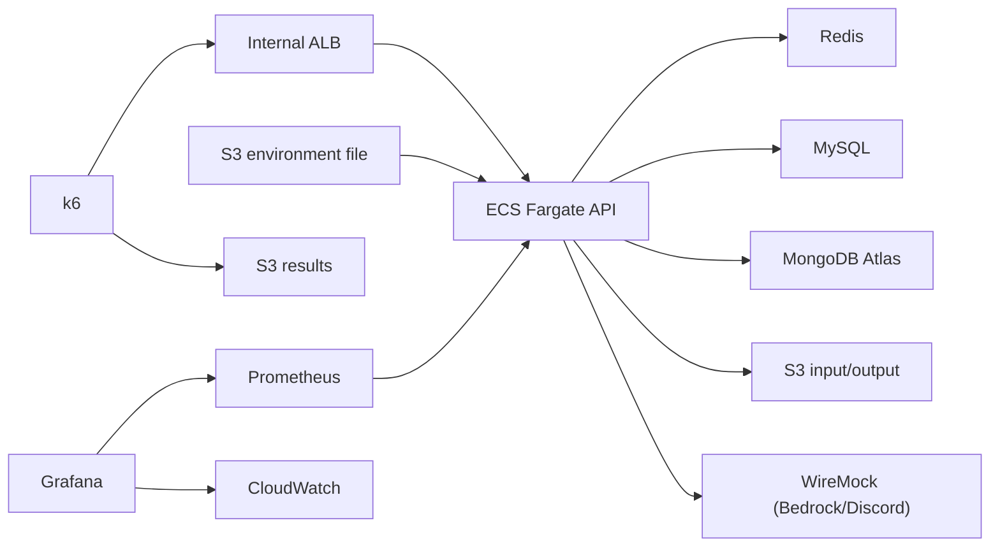

# 재사용 가능한 부하 테스트 플랫폼 계획

## 아키텍처

도메인별 부하 테스트가 공통으로 사용할 AWS 실행 기반이다. 테스트마다 인프라를 생성하고, 부하와 메트릭을 수집한 뒤 제거한다. 운영 환경을 그대로 복제하기보다 API 인스턴스 수, 부하 시나리오, 외부 의존성 연결을 통제해 비교 가능한 실험을 만드는 것이 목표다.

첫 번째 실험은 Word single-flight다. 이후 Book 조회, 저장소 전환, 외부 의존성 장애 대응에도 같은 기반을 사용한다.

## AWS 리소스

| 리소스 | 용도 |
| --- | --- |
| VPC, Subnet, Security Group | 테스트 환경의 네트워크 격리와 통신 제어 |
| Internal ALB | k6 요청을 API task로 라우팅 |
| ECS Fargate | API, k6, Redis, MySQL, external API mock, Prometheus, Grafana 컨테이너 실행 |
| MongoDB Atlas | 사용자가 유지하는 테스트 데이터 저장소. 실행 중에만 IP allowlist를 임시로 전체 허용 |
| External API mock (WireMock) | Bedrock과 Discord의 성공·지연·오류를 통제 |
| CloudWatch Logs/Metrics | ECS, ALB 로그와 인프라 메트릭 수집 |
| S3 | AI input/output bucket, environment file 전달, Terraform state와 실행 결과 보관 |
| IAM Role | Terraform 프로비저닝 권한과 ECS task의 S3 접근 권한 부여 |

## 단계별 범위

| 단계 | 목표 | 포함 구성 | 완료 기준 |
| --- | --- | --- | --- |
| 1단계 | Terraform으로 컨테이너를 생성하고 제거한다. | VPC, Internal ALB, ECS Fargate API, CloudWatch Logs | ALB health check 성공 후 `terraform destroy`로 런타임 리소스가 제거된다. |
| 2단계 | 의존성이 연결된 API에 k6 부하를 전달한다. | 1단계 + k6, Redis, MySQL, MongoDB Atlas, external API mock | k6가 ALB를 통해 API를 호출하고 API 또는 전용 probe가 각 의존성의 연결을 확인한다. |
| 3단계 | 부하 결과와 애플리케이션·인프라 상태를 Grafana에서 함께 분석한다. | 2단계 + Prometheus, Grafana, CloudWatch, 결과 S3 | 동일 실행 시간 범위의 지표와 원본 결과를 조회·보관한다. |

## 2단계 운영 경계

- 테스트 task는 public subnet에서 public IP를 사용한다. NAT Gateway와 고정 EIP는 구성하지 않고, inbound는 Security Group으로 제한한다.
- 병목 분석 대상인 ALB, ECS, Atlas, Redis, MySQL, S3는 실제 환경과 유사한 구성으로 사용한다.
- Atlas는 테스트 전용 cluster와 최소 권한 계정을 사용한다. IP allowlist의 `0.0.0.0/0` 허용은 테스트 중에만 유지하고 종료 직후 제거한다.
- S3 AI input/output bucket은 Terraform으로 생성한다. public access 차단, 암호화, ECS task role 최소 권한을 적용하고 테스트 종료 시 제거한다.
- 비밀값은 서비스별 임시 `.env`를 S3 environment file로 전달한다. Terraform은 bucket, object key, IAM만 관리하고 객체 내용은 관리하지 않아 비밀값이 state에 기록되지 않게 한다.
- 실행 스크립트가 로컬 `.env`를 S3에 업로드하고, 테스트 종료 시 S3 객체와 로컬 파일을 모두 삭제한다.
- Bedrock과 Discord는 WireMock Standalone으로 성공·지연·오류를 통제한다. mapping은 저장소에서 관리하고 테스트 전에 Admin API로 등록하며 request journal로 실제 호출 횟수를 확인한다.
- Firebase Auth 호출 대신 테스트 JWT를 사용하고 FCM bean은 mock/no-op으로 대체한다. Sentry는 비활성화한다.
- Bedrock 실제 지연 시간은 부하 테스트와 분리한 소규모 실호출로 측정해 mock 지연 값을 보정한다.
- 2단계는 의존성 연결과 k6 요청 전달까지만 검증한다. exporter, Prometheus, Grafana를 통한 메트릭 수집은 3단계에서 추가한다.

## 3단계 수집 지표

| 범주 | 지표 |
| --- | --- |
| Client (k6) | 요청·성공·실패 RPS, P50/P95/P99, active VU, dropped iteration, 오류 유형 |
| API endpoint | endpoint별 RPS, 성공·실패 응답 시간, HTTP 4xx/5xx, 비즈니스 오류 수 |
| JVM/Tomcat | CPU, RSS, heap, GC pause, thread 수, Tomcat busy/max thread, connection 수 |
| ALB/ECS | target response time, ALB/target 5xx, healthy target 수, task CPU·memory·network, restart 수 |
| Saturation | in-flight request, queue wait, rejection, rate limit 차단, circuit breaker 차단 |
| Word single-flight | leader/follower 수, follower 대기 시간·timeout, lock 획득·해제 실패 |
| Bedrock | 호출 시간, success/timeout/error, retry 수, in-flight 호출 수, circuit breaker 상태·차단 수 |
| 실행 맥락 | test run ID, Git SHA, image digest, task size, VU, duration, 실행 시작·종료 시각 |

Grafana는 사람이 보는 분석 화면으로 사용한다. AI 보고서와 재현을 위해서는 k6 결과, PromQL 결과, CloudWatch 조회 결과, 실행 맥락을 같은 `test_run_id`로 S3에 함께 보관한다. 사용자 ID, 단어, 요청 ID처럼 cardinality가 무한한 값은 metric label로 사용하지 않는다.
