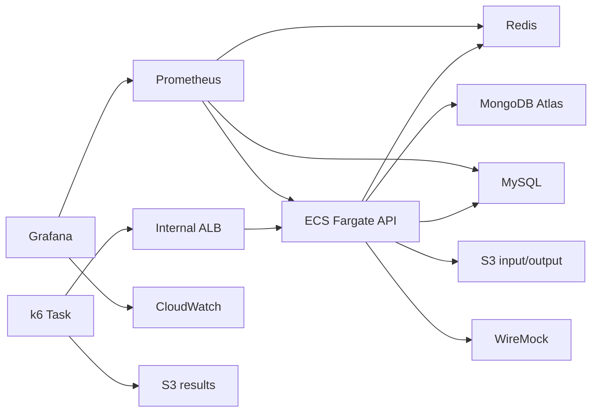

# 재사용 가능한 부하 테스트 인프라 계획

## 목적

운영 환경과 유사한 의존성을 갖춘 테스트 인프라를 한 번 생성하고, 상태 초기화와 k6 실행을 반복하면서 애플리케이션 병목을 분석한다. 테스트가 끝난 뒤 Grafana 분석까지 완료하면 전체 인프라를 제거한다.

## 아키텍처



Bedrock과 Discord는 WireMock으로 성공, 지연, 오류 응답을 통제한다. Atlas, Redis, MySQL, S3는 실제 의존성을 사용한다.

## 목표 실행 주기

```text
up -> reset -> run -> reset -> run -> down
```

| 명령 | 역할 |
| --- | --- |
| `up` | 전체 인프라를 생성하고 연결을 검증한 뒤 최초 상태 초기화를 실행한다. |
| `run` | 기존 인프라에서 일회성 k6 Task만 실행한다. |
| `reset` | MongoDB, Redis, MySQL, WireMock을 기준 상태로 되돌린다. |
| `status` | 인프라 상태와 Grafana 주소를 확인한다. |
| `down` | 분석 완료 후 전체 인프라를 제거한다. |

인프라를 식별하는 세션 ID와 개별 k6 실행 ID를 분리한다. 하나의 세션에서 여러 실행을 수행하되 각 실행 결과는 별도 ID로 구분한다.

## 상태 초기화

- seed 데이터는 `infra/performance-test/seed/`에서 관리한다.
- 초기화 작업은 반복 실행해도 같은 결과가 나오는 멱등 구조로 만든다.
- MongoDB와 MySQL은 테스트 전용 데이터베이스만 초기화한다.
- Redis는 테스트 전용 인스턴스의 상태를 제거한다.
- WireMock은 요청 기록과 mapping을 초기화한 뒤 선택한 시나리오를 다시 등록한다.
- 테스트 실행 중에는 초기화를 허용하지 않는다.

## 모니터링

세션이 유지되는 동안 Prometheus와 Grafana에서 다음 범주를 분석한다.

- API 요청량, 응답 시간, 오류율
- JVM, GC, thread와 connection 상태
- Redis와 MySQL exporter 지표
- ECS와 ALB의 CPU, memory, target 상태
- single-flight, Bedrock, circuit breaker 애플리케이션 지표

기본 대시보드는 여러 API 인스턴스의 지표를 합산한다. 인스턴스별 분석이 필요하면 `instance` 라벨로 구분한다. Prometheus 데이터는 테스트 세션 동안만 유지하며 원격 저장과 자동 리포트는 현재 범위에 포함하지 않는다.

## 운영 경계

- ECS Task는 public subnet과 public IP를 사용하고 inbound는 Security Group으로 제한한다.
- Atlas는 테스트 전용 계정과 데이터베이스를 사용하며 테스트 종료 후 임시 IP allowlist를 제거한다.
- 비밀값은 Git에서 제외한 로컬 `.env.app`에서 서비스별 S3 environment file로 전달하고 Terraform state에는 저장하지 않는다.
- S3 bucket은 public access를 차단하고 암호화와 ECS Task 최소 권한을 적용한다.
- Firebase Auth는 테스트 JWT로 대체하고 FCM과 Sentry는 비활성화한다.

## 현재 범위 제외

- 구체적인 도메인 부하 시나리오
- 워밍업과 측정 구간 자동화
- 성능 한계와 성공 기준
- 반복 측정과 통계 분석
- 원격 메트릭 저장과 자동 리포트
