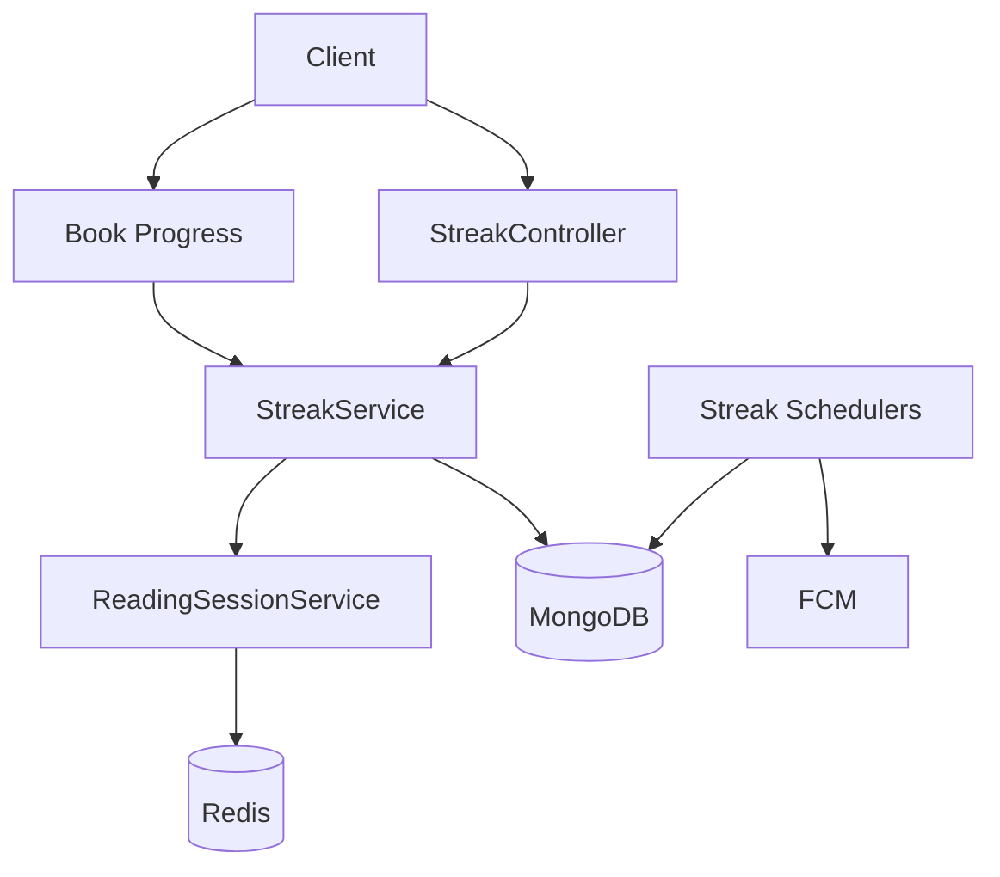
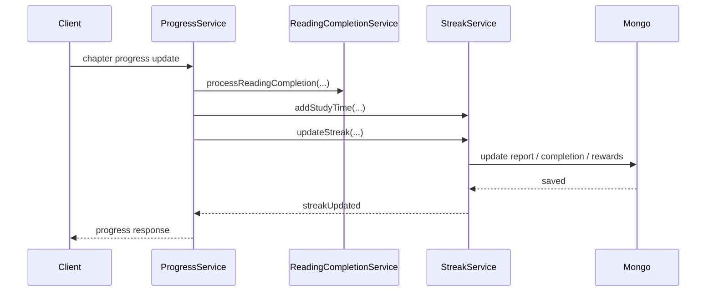
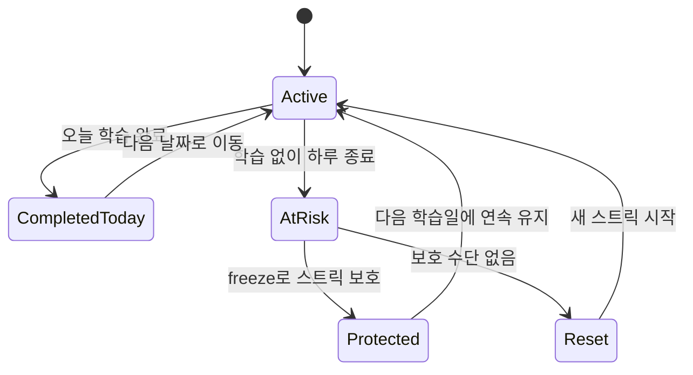

# Streak 도메인 구조

## 목적

이 문서는 스트릭 도메인이 어떻게 학습 완료, 보상, 프리즈, 알림을 처리하는지 설명한다.

## 범위

- `StreakService`
- `ReadingSessionService`
- 스트릭 관련 스케줄러
- `UserStudyReport`, `DailyCompletion`, `FreezeTransaction`

## 핵심 구성 요소

- `StreakController`
- `StreakService`
- `ReadingSessionService`
- `StreakProtectionScheduler`
- `UserStudyReportRepository`, `DailyCompletionRepository`, `FreezeTransactionRepository`

## 구조 요약

스트릭 도메인은 사용자의 학습 연속성을 계산하는 핵심 서비스다.
읽기 세션은 Redis에 짧게 저장하고, 실제 누적 리포트와 완료 기록은 MongoDB에 저장한다.
책 읽기 완료나 다른 콘텐츠 완료 흐름에서 `StreakService`를 호출해 스트릭을 갱신하고, 스케줄러는 밤 시간대에 보호 알림을 보낸다.

## Mermaid 다이어그램

### 구조 관계

### 대표 흐름: 읽기 완료 후 스트릭 갱신

### 상태 관점

## 주요 흐름 설명

1. 사용자가 학습을 시작하면 `ReadingSessionService`가 Redis에 읽기 세션을 저장한다.
2. 읽기 완료 시 `ProgressService` 같은 상위 도메인이 `StreakService`를 호출해 학습 시간, 스트릭, 완료 콘텐츠를 갱신한다.
3. `StreakService`는 오늘/어제 상태, 누락 일수, 프리즈 사용 여부를 계산하고 보상 지급 여부도 함께 판단한다.
4. `StreakProtectionScheduler`는 밤 9시에 오늘 미완료 사용자를 찾아 FCM 보호 알림을 보낸다.

## 핵심 데이터

- `UserStudyReport`
  - 현재 스트릭, 최장 스트릭, 사용 가능 프리즈, 총 학습 시간 등 누적 상태
- `DailyCompletion`
  - 일자별 완료 상태
- `FreezeTransaction`
  - 프리즈 지급/사용 내역

## 개선 포인트

- `StreakService`에 상태 계산, 보상 지급, 통계 응답 조립이 많이 모여 있어 분리 여지가 크다.
- Redis 세션 검증, 읽기 시간 계산, 콘텐츠 완료 처리 경계가 다른 도메인과 섞여 있다.
- 스케줄러 알림 정책과 도메인 규칙이 점점 가까워지면 테스트 경계가 흐려질 수 있다.

## 참고 코드

- `src/main/java/com/linglevel/api/streak/service/StreakService.java`
- `src/main/java/com/linglevel/api/streak/service/ReadingSessionService.java`
- `src/main/java/com/linglevel/api/streak/scheduler/StreakProtectionScheduler.java`
- `src/main/java/com/linglevel/api/content/book/service/ProgressService.java`
