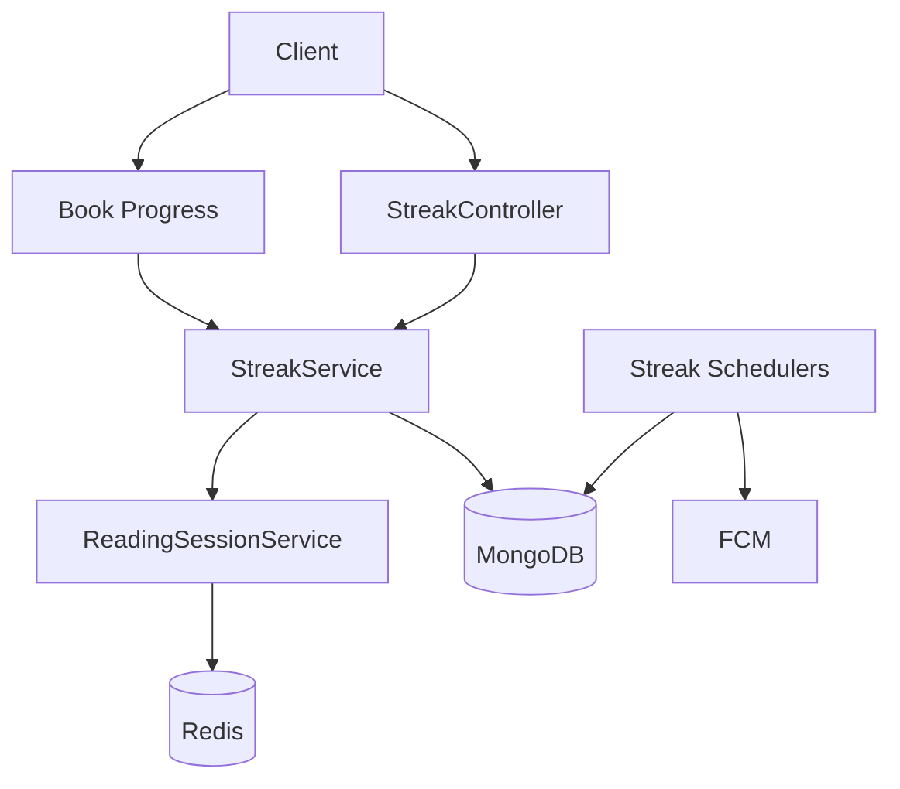
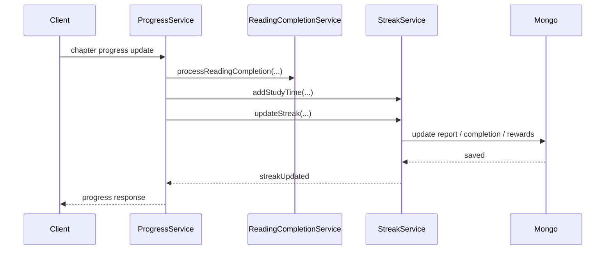

# Streak 도메인 미니맵

## 현재 시스템의 책임

- 사용자 학습 연속일 수를 계산한다.
- 읽기 세션과 학습 시간을 관리한다.
- 프리즈, 보상, 완료 기록을 갱신한다.
- 보호 알림과 관련 스케줄 작업을 수행한다.

## 도메인 구조

- 스트릭은 사용자별 누적 리포트와 일자별 완료 기록으로 상태를 계산한다.
- 읽기 세션은 Redis에 짧게 저장되고, 확정된 상태는 MongoDB에 반영된다.
- 프리즈와 보상 기록은 별도 트랜잭션/이력 데이터로 관리된다.

## 외부 시스템 의존성

- MongoDB: 누적 리포트와 완료 기록 저장
- Redis: 읽기 세션과 짧은 상태 저장
- FCM: 보호 알림 발송
- content/book: 읽기 완료 이벤트가 유입되는 주요 호출 지점

## 핵심 기능

- 읽기 완료 후 스트릭 갱신
- 읽기 세션 관리
- 보호 알림 스케줄링

## 핵심 기능 흐름

### 읽기 완료 후 스트릭 갱신

## 핵심 기능 선정 기준

1. 스트릭 갱신은 다른 학습 도메인에서 공통으로 호출하는 핵심 교차 지점이다.
2. `리딩 세션 -> 누적 상태 -> 알림`으로 이어지는 도메인 구조를 같이 이해해야 한다.
3. Redis, MongoDB, FCM이 함께 등장해 의존성 파악 가치가 크다.
4. 세션, 누적 상태, 스케줄러가 모두 연결돼 있어 처음 읽는 난이도가 높다.

## 참고 코드

- `src/main/java/com/linglevel/api/streak/service/StreakService.java`
- `src/main/java/com/linglevel/api/streak/service/ReadingSessionService.java`
- `src/main/java/com/linglevel/api/streak/scheduler/StreakProtectionScheduler.java`
- `src/main/java/com/linglevel/api/content/book/service/ProgressService.java`
