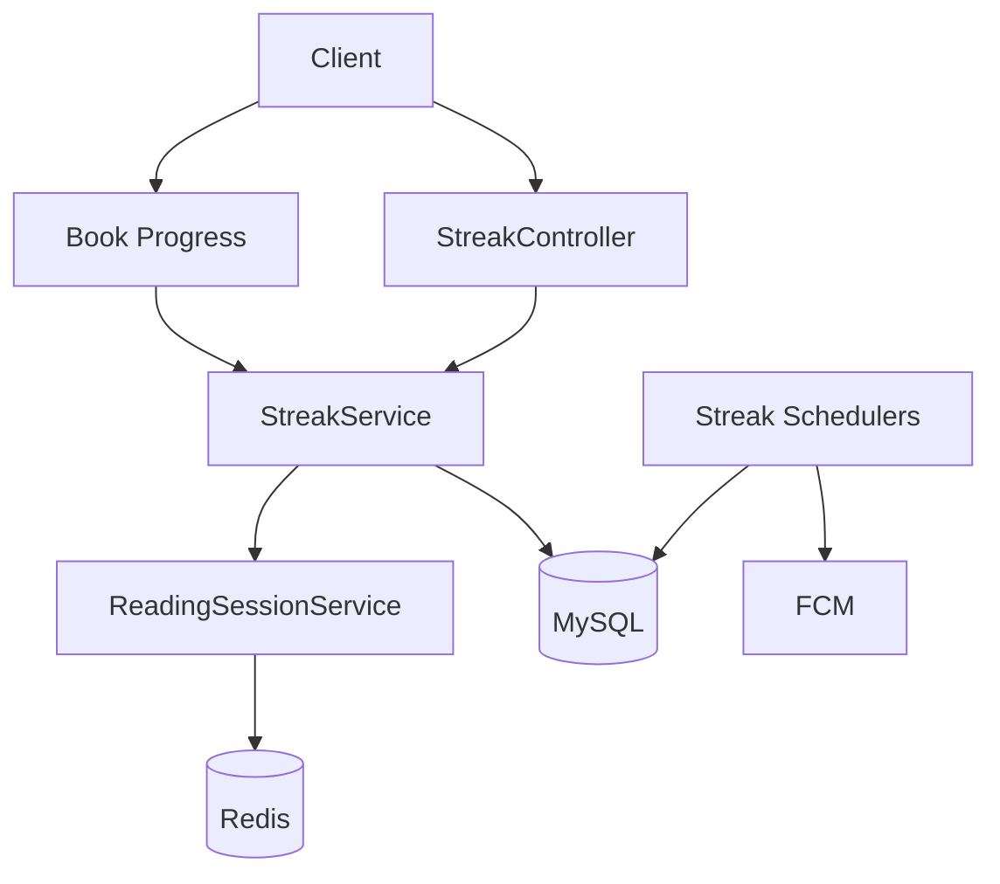
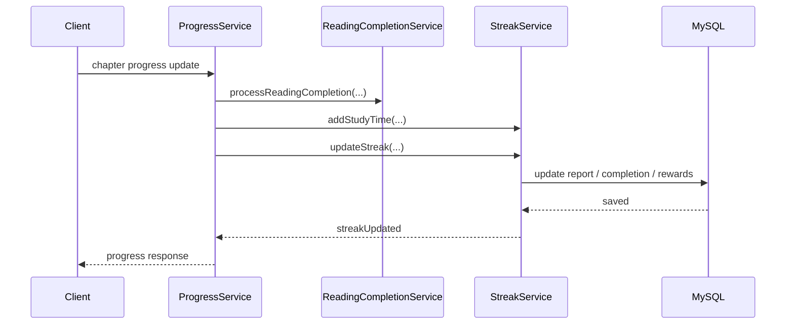

# Streak 도메인 미니맵

## 현재 시스템의 책임

- 사용자 학습 연속일 수를 계산한다.
- 읽기 세션과 학습 시간을 관리한다.
- 프리즈, 보상, 완료 기록을 갱신한다.
- 보호 알림과 관련 스케줄 작업을 수행한다.

## 도메인 구조

- 스트릭은 사용자별 누적 리포트와 일자별 완료 기록으로 상태를 계산한다.
- 읽기 세션은 Redis에 짧게 저장되고, 확정된 상태는 MySQL에 반영된다.
- 프리즈와 보상 기록은 별도 거래 이력으로 관리하며 일별 상태·잔액 변경과 같은 SQL 트랜잭션에 저장한다.
- 일별 완료 목록은 learning_completions 행으로 분리하고 콘텐츠 유형·ID를 함께 식별한다. 사용자별 잠금으로 최초 완료 집계와 일별 보상 지급의 경합을 제어한다.
- 처리 후 스케줄러가 오래된 리포트를 다시 저장하지 않는다. 프리즈 처리 시각과 적용 날짜를 구분한다.

## 핵심 용어 사전

| 용어 | 정의 |
| --- | --- |
| 스트릭 | 학습 완료를 일 단위로 누적한 연속 기록 |
| 읽기 세션 | 학습 시작 시점부터 종료/완료 처리 전까지의 임시 상태 |
| 프리즈 | 스트릭을 하루 보호하는 소모성 보호 자원 |
| 완료 기록 | 특정 날짜 학습 완료 여부를 확정한 데이터 |

## 외부 시스템 의존성

- MySQL: 누적 리포트와 완료 기록 저장
- Redis: 읽기 세션과 짧은 상태 저장
- FCM: 보호 알림 발송
- content/book: 읽기 완료 이벤트가 유입되는 주요 호출 지점

```mermaid
flowchart TD
    Client[Client]
    Book[Book Progress]
    Controller[StreakController]
    Service[StreakService]
    Session[ReadingSessionService]
    Scheduler[Streak Schedulers]
    MySQL[(MySQL)]
    Redis[(Redis)]
    FCM[FCM]

    Client --> Controller
    Client --> Book
    Book --> Service
    Controller --> Service
    Service --> Session
    Session --> Redis
    Service --> MySQL
    Scheduler --> MySQL
    Scheduler --> FCM
```

## 핵심 기능

- 읽기 완료 후 스트릭 갱신
- 읽기 세션 관리
- 보호 알림 스케줄링

## 핵심 기능 흐름

### 읽기 완료 후 스트릭 갱신

```mermaid
sequenceDiagram
    participant Client
    participant ProgressService
    participant ReadingCompletionService
    participant StreakService
    participant MySQL

    Client->>ProgressService: chapter progress update
    ProgressService->>ReadingCompletionService: processReadingCompletion(...)
    ProgressService->>StreakService: addStudyTime(...)
    ProgressService->>StreakService: updateStreak(...)
    StreakService->>MySQL: update report / completion / rewards
    MySQL-->>StreakService: saved
    StreakService-->>ProgressService: streakUpdated
    ProgressService-->>Client: progress response
```

## 핵심 기능 선정 기준

1. 스트릭 갱신은 다른 학습 도메인에서 공통으로 호출하는 핵심 교차 지점이다.
2. `리딩 세션 -> 누적 상태 -> 알림`으로 이어지는 도메인 구조를 같이 이해해야 한다.
3. Redis, MySQL, FCM이 함께 등장해 의존성 파악 가치가 크다.
4. 세션, 누적 상태, 스케줄러가 모두 연결돼 있어 처음 읽는 난이도가 높다.

## 간결 의사결정 기록

| 날짜 | 결정 | 이유 | 영향 범위 | 상태 |
| --- | --- | --- | --- | --- |
| 2026-09-15 | 세션 상태는 Redis, 확정 상태는 MySQL로 분리 | 짧은 상태와 영속 상태의 책임을 분리해 운영 단순화 | ReadingSessionService, StreakService | 유지 |

## 전환 경계

- BIGINT ID·스키마·보장 범위는 [MySQL 재설계 문서](mysql-first-redesign.md)를 따른다.
- 반복 읽기 이력은 여러 건 저장하되 하루 스트릭 보상은 한 번만 지급한다.
- 진행률도 SQL 트랜잭션에 포함된다. Redis 세션과 이미 발행한 접근 이벤트는 SQL 롤백 대상이 아니며, 전송 재시도에 대한 종단 멱등성은 별도 과제다.

## 참고 코드

- `src/main/java/com/linglevel/api/streak/service/StreakService.java`
- `src/main/java/com/linglevel/api/streak/service/ReadingSessionService.java`
- `src/main/java/com/linglevel/api/streak/scheduler/StreakProtectionScheduler.java`
- `src/main/java/com/linglevel/api/content/book/service/ProgressService.java`
