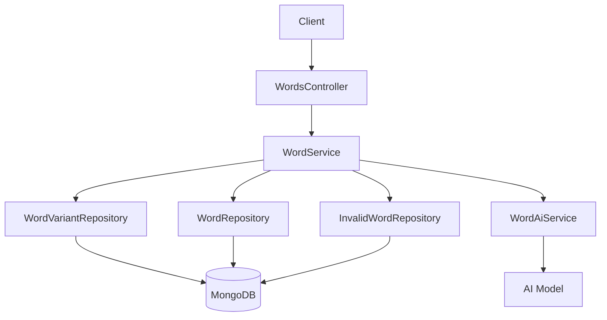
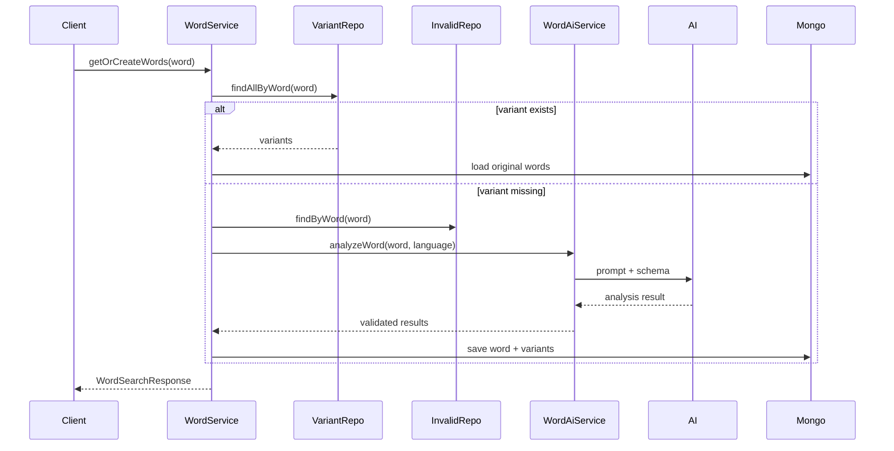

# Word 도메인 미니맵

## 현재 시스템의 책임

- 단어 조회 API를 제공한다.
- 입력 단어와 원형 단어의 관계를 관리한다.
- 단어 데이터가 없을 때 AI 분석으로 보완한다.
- 실패한 단어를 차단 캐시로 관리한다.

## 도메인 구조

- 원형 단어 본문은 `Word`로 저장된다.
- 입력 단어와 원형 단어의 연결은 `WordVariant`로 관리된다.
- 반복 실패 단어는 `InvalidWord`에 저장해 재시도를 줄인다.

## 핵심 용어 사전

| 용어 | 정의 |
| --- | --- |
| 원형 단어 | 실제 사전/학습 기준이 되는 canonical 단어 |
| 입력 단어 | 사용자가 검색한 원문 입력값 |
| variant | 입력 단어와 원형 단어를 연결하는 매핑 엔티티 |
| invalid word | 반복 실패 단어를 차단하기 위한 캐시 데이터 |

## 외부 시스템 의존성

- MongoDB: 단어 본문, variant, invalid cache 저장
- AI Model: 새 단어 분석과 생성 요청

## 핵심 기능

- 단어 조회
- variant 기반 원형 매핑
- AI 기반 신규 단어 생성

## 핵심 기능 흐름

### 단어 조회 및 생성

## 핵심 기능 선정 기준

1. 조회처럼 보이지만 캐시, 저장, AI 호출이 함께 묶여 있어 흐름이 길다.
2. `Word`, `WordVariant`, `InvalidWord`의 역할을 같이 이해해야 실제 동작을 읽을 수 있다.
3. 외부 AI 의존성이 있어 실패 경로까지 같이 파악해야 한다.
4. variant와 invalid cache가 조회 흐름 초반에 분기점 역할을 한다.

## 간결 의사결정 기록

| 날짜 | 결정 | 이유 | 영향 범위 | 상태 |
| --- | --- | --- | --- | --- |
| 2026-04-08 | `Word/Variant/Invalid` 3분할 구조 유지 | 조회 성능, 정합성, 실패 재시도 제어를 분리하기 위함 | WordService, 관련 Repository | 유지 |

## 참고 코드

- `src/main/java/com/linglevel/api/word/service/WordService.java`
- `src/main/java/com/linglevel/api/word/service/WordAiService.java`
- `src/main/java/com/linglevel/api/word/entity/Word.java`
- `src/main/java/com/linglevel/api/word/entity/WordVariant.java`
- `src/main/java/com/linglevel/api/word/entity/InvalidWord.java`
