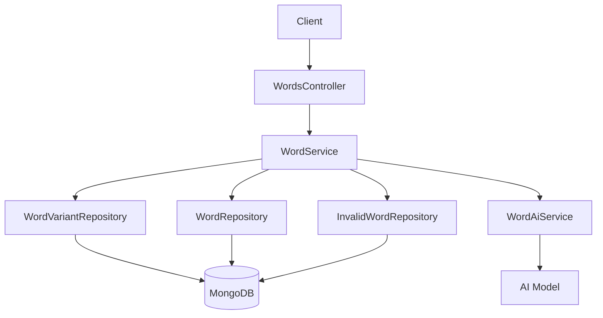
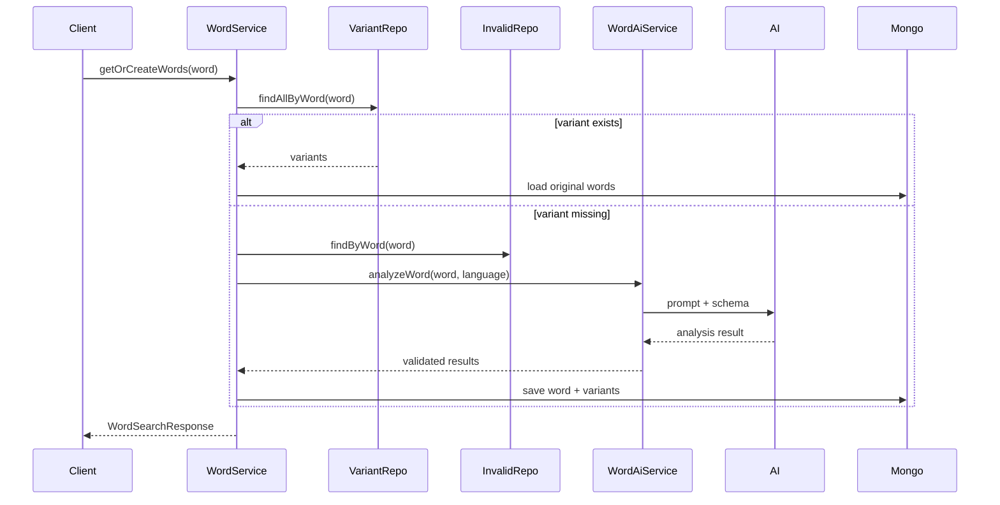

# Word 도메인 구조

## 목적

이 문서는 단어 조회와 AI 분석 흐름이 어떻게 결합돼 있는지 설명한다.

## 범위

- `WordService`
- `WordAiService`
- `WordVariant`, `InvalidWord`, `Word`
- 단어 조회 및 생성 흐름

## 핵심 구성 요소

- `WordsController`
- `WordService`
- `WordAiService`
- `WordVariantRepository`, `WordRepository`, `InvalidWordRepository`

## 구조 요약

Word 도메인은 사용자가 입력한 단어를 바로 조회하지 않고, 먼저 원형/변형 관계를 확인한 뒤 필요한 경우 AI 분석으로 보완한다.
MongoDB에는 단어 본문, 변형 형태, 실패 캐시를 따로 저장하고, AI 결과는 검증과 필터링을 거친 뒤 저장한다.
즉 이 도메인은 조회 API처럼 보이지만 실제로는 캐시, 분석, 검증, 저장이 한 흐름에 묶인 구조다.

## Mermaid 다이어그램

### 구조 관계

### 대표 흐름: 단어 조회 및 생성

## 주요 흐름 설명

1. 먼저 `WordVariantRepository`에서 입력 단어가 이미 다른 원형에 연결된 변형인지 확인한다.
2. 데이터가 없으면 `InvalidWordRepository`를 확인해 반복 실패 단어를 빠르게 차단한다.
3. AI 호출이 필요하면 `WordAiService`가 강한 프롬프트, Bean schema, validation, enum 필터링, homograph 병합을 적용한다.
4. 성공 결과는 `Word`와 `WordVariant`로 나눠 저장하고, 이후 요청에서는 캐시처럼 재사용한다.

## 핵심 데이터

- `Word`
  - 원형 단어, 번역, 의미, 활용형 정보
- `WordVariant`
  - 입력 단어와 원형 단어 연결
- `InvalidWord`
  - 반복 실패한 단어에 대한 차단 캐시

## 이 도메인의 특징

- AI 응답을 그대로 신뢰하지 않고 validation과 enum 정리를 한 번 더 거친다.
- 같은 원형으로 합쳐야 하는 homograph/variant 처리를 서비스 쪽에서 보정한다.
- 실패한 단어를 `InvalidWord`로 캐시해 불필요한 재호출을 줄인다.

## 개선 포인트

- `WordService`가 캐시 판단, 예외 전략, 저장 규칙까지 많이 알고 있어 책임이 크다.
- `WordAiService`는 프롬프트, 비용 로깅, 응답 검증을 함께 갖고 있어 분리 후보가 될 수 있다.
- AI 실패 정책과 사용자 응답 정책을 더 명확히 나누면 테스트가 쉬워질 수 있다.

## 참고 코드

- `src/main/java/com/linglevel/api/word/service/WordService.java`
- `src/main/java/com/linglevel/api/word/service/WordAiService.java`
- `src/main/java/com/linglevel/api/word/entity/Word.java`
- `src/main/java/com/linglevel/api/word/entity/WordVariant.java`
- `src/main/java/com/linglevel/api/word/entity/InvalidWord.java`
