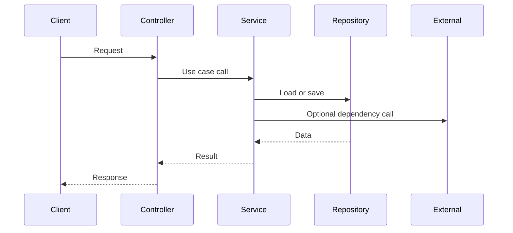
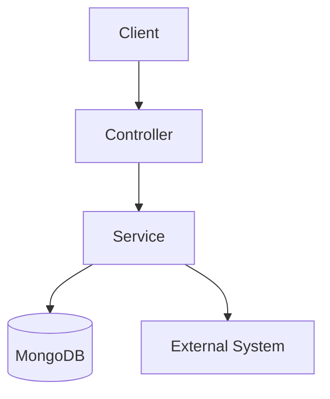

# Architecture Template

## 제목

짧고 명확한 문서 제목

## 현재 시스템의 책임

- 이 도메인이나 시스템이 담당하는 핵심 책임 2~4개
- 조회, 저장, 계산, 외부 연동 중 무엇이 중심인지
- 다른 도메인과 구분되는 역할이 무엇인지

## 도메인 구조

- 이 도메인을 구성하는 핵심 개체나 하위 구조를 짧게 적는다
- 1:N 관계나 상위/하위 개념이 있다면 여기서 먼저 정리한다
- 읽는 사람이 도메인 내부 shape를 빠르게 잡을 수 있으면 충분하다

## 핵심 용어 사전

용어 혼동으로 의미가 흔들리지 않도록, 최소한의 도메인 용어만 관리한다.
각 항목은 `용어`와 `정의`만 유지한다.

예시:

| 용어 | 정의 |
| --- | --- |
| 진행률 | 사용자의 현재 학습 위치를 퍼센트로 표현한 값 |
| 완료 | 도메인이 정의한 완료 조건을 만족한 상태 |
| 세션 | 특정 사용자 학습 행위의 추적 단위 |

## 외부 시스템 의존성

- 사용하는 저장소, 캐시, 메시징, 외부 API
- 의존 시스템이 없다면 생략 가능
- 가능하면 "왜 붙는지"를 한 줄로 적는다
- 거시적인 관점에서 system context diagram을 포함한다.

예시:

- MongoDB: 핵심 도메인 데이터 저장
- Redis: 짧은 상태 또는 세션 저장
- S3 / R2: 파일 저장
- FCM: 알림 발송
- AI Model: 분석 또는 생성 요청

## 핵심 기능

- 핵심 기능은 2~3개만 고른다
- 각 기능은 중요도 + 복잡도/이해 난이도를 기준으로 선정한다
- 이름만 봐도 읽기 시작점을 알 수 있게 쓴다

예시:

- 책 목록 조회
- 진행도 업데이트
- 단어 조회 및 생성

## 핵심 기능 흐름

핵심 기능마다 시퀀스 다이어그램 또는 데이터 흐름 중 하나만 둔다.
기능당 다이어그램 1개면 충분하다.

### 기능 흐름 예시

### 데이터 흐름 예시

## 핵심 기능 선정 기준

각 기능을 왜 핵심으로 봤는지 짧게 적는다.

1. 요청이 어디서 시작되는가
2. 어느 서비스나 도메인이 중심 책임을 갖는가
3. 도메인 구조를 이해해야 읽을 수 있는 포인트가 있는가
4. 어떤 저장소나 외부 시스템과 결합되는가
5. 왜 중요하거나 복잡한가

## 의사결정 기록

아키텍처/도메인 의미에 영향을 주는 결정은 이 문서에 간결하게 남긴다.
복잡한 별도 문서로 분리하기 전에, 아래 형식으로 먼저 누적한다.

| 날짜 | 결정 | 이유 | 영향 범위 | 상태 |
| --- | --- | --- | --- | --- |
| 2026-04-08 | 진행률 계산 기준을 chapter completion으로 통일 | API 간 의미 불일치 제거 | ProgressService, BookService | 유지 |

상태 예시: `유지`, `대체 예정`, `폐기`

## 참고 코드

- 관련 패키지 또는 파일 경로
