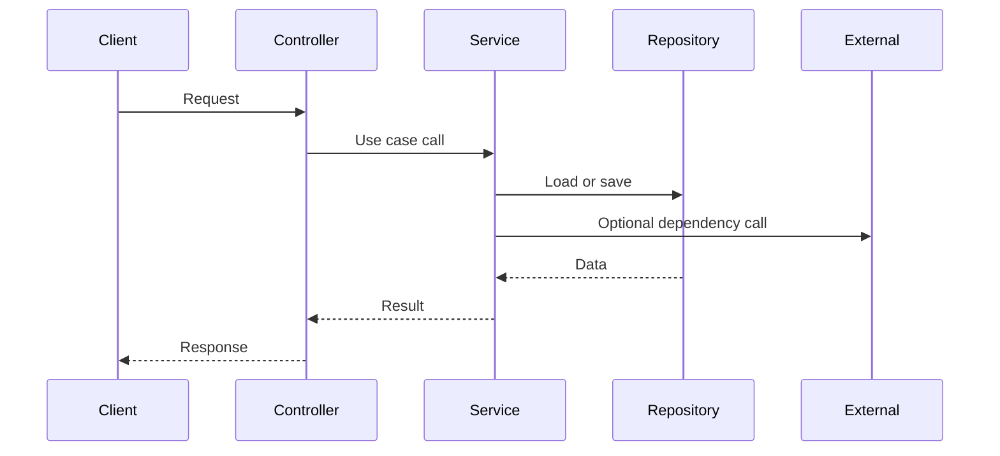
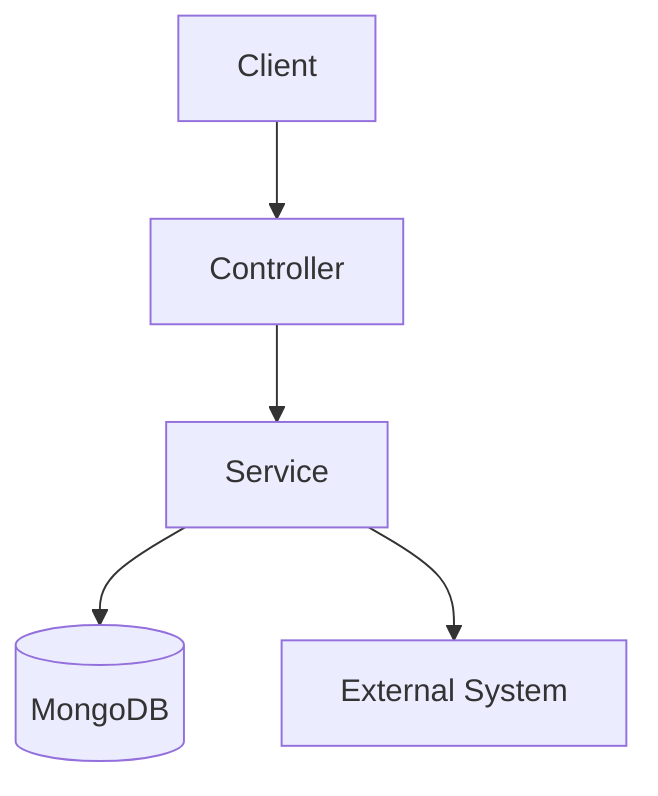

# Architecture Template

## 제목

짧고 명확한 문서 제목

## 현재 시스템의 책임

- 이 도메인이나 시스템이 담당하는 핵심 책임 2~4개
- 조회, 저장, 계산, 외부 연동 중 무엇이 중심인지
- 다른 도메인과 구분되는 역할이 무엇인지

## 외부 시스템 의존성

- 사용하는 저장소, 캐시, 메시징, 외부 API
- 의존 시스템이 없다면 생략 가능
- 가능하면 "왜 붙는지"를 한 줄로 적는다
- 거시적인 관점에서 architecture context diagram을 포함한다.

예시:

- MongoDB: 핵심 도메인 데이터 저장
- Redis: 짧은 상태 또는 세션 저장
- S3 / R2: 파일 저장
- FCM: 알림 발송
- AI Model: 분석 또는 생성 요청

## 핵심 기능

- 핵심 기능은 2~3개만 고른다
- 각 기능은 중요도 + 복잡도/이해 난이도를 기준으로 선정한다
- 이름만 봐도 읽기 시작점을 알 수 있게 쓴다

예시:

- 책 목록 조회
- 진행도 업데이트
- 단어 조회 및 생성

## 핵심 기능 흐름

핵심 기능마다 시퀀스 다이어그램 또는 데이터 흐름 중 하나만 둔다.
기능당 다이어그램 1개면 충분하다.

### 기능 흐름 예시

### 데이터 흐름 예시

## 핵심 기능 선정 기준

각 기능을 왜 핵심으로 봤는지 짧게 적는다.

1. 요청이 어디서 시작되는가
2. 어느 서비스나 도메인이 중심 책임을 갖는가
3. 어떤 저장소나 외부 시스템과 결합되는가
4. 왜 중요하거나 복잡한가

## 참고 코드

- 관련 패키지 또는 파일 경로
