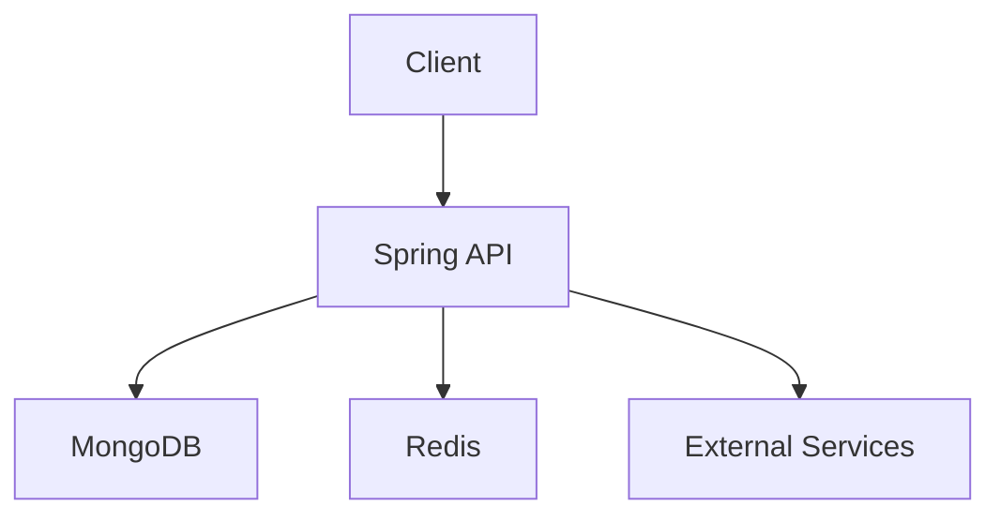
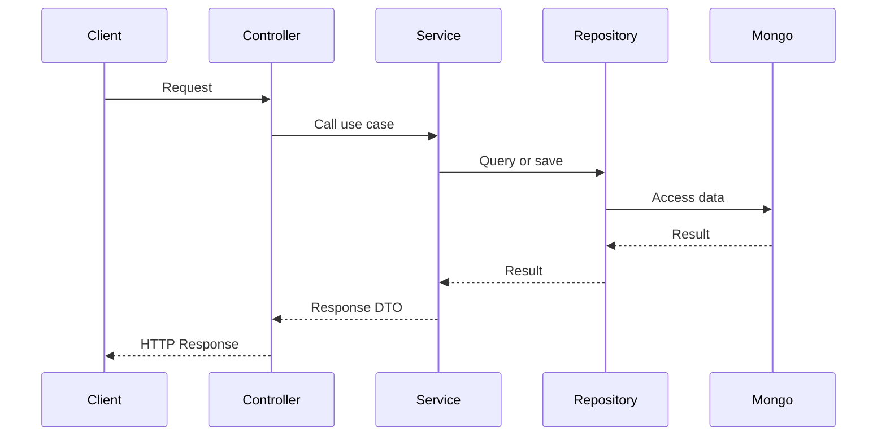
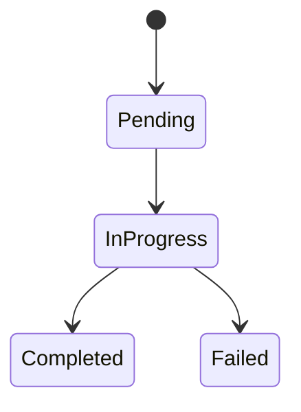

# Architecture Template

## 제목

짧고 명확한 문서 제목

## 목적

이 문서가 어떤 구조나 흐름을 설명하기 위한 것인지 적는다.

## 범위

어떤 도메인, 기능, 요청 흐름을 다루는지 적는다.

## 핵심 구성 요소

- 구성 요소 1
- 구성 요소 2
- 구성 요소 3

## 구조 요약

현재 구조를 짧게 설명한다.

## Mermaid 다이어그램

필요한 경우 아래 예시 중 하나를 복사해서 사용한다.

### 시스템/도메인 관계 예시

### 요청 흐름 예시

### 상태 전이 예시

## 주요 흐름 설명

다이어그램만으로 부족한 핵심 흐름을 짧게 설명한다.

1. 요청이 어디서 시작되는가
2. 어떤 서비스가 핵심 규칙을 담당하는가
3. 어떤 저장소나 외부 시스템에 의존하는가

## 개선 포인트

- 현재 구조의 문제
- 리팩터링 후보
- 성능 또는 안정성 리스크

## 참고 코드

- 관련 패키지 또는 파일 경로
